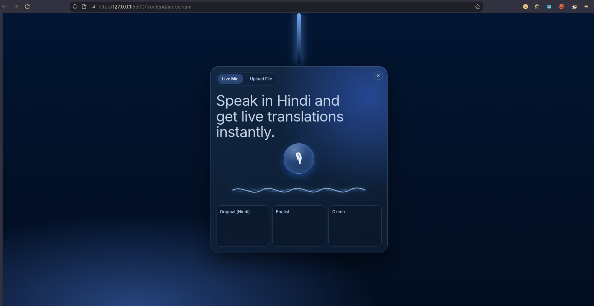

Designed a real-time multilingual speech translation pipeline processing streaming audio with \textbf{sub-second (\textless1s) latency} using Web Audio API and WebSockets for continuous data transmission.

Developed an asynchronous FastAPI backend implementing WebSocket-based streaming to handle concurrent audio processing, request routing, and low-latency real-time inference pipelines.

Integrated Deepgram STT and Google Gemini APIs for speech recognition and translation, enabling live multilingual transcription across \textbf{3+ languages} through API-based inference services.

Under Progress..
